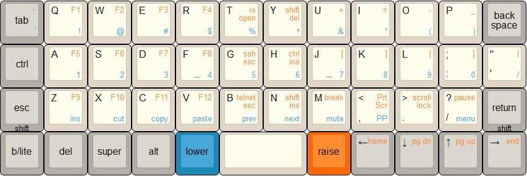

# Personal Planck keymap

This is my keymap for a 40% ortholinear keyboard call the Planck. It's layout is designed with a network engineering role in mind.

- UNIX l_ctrl location
- Cursor movement keys on base layer
- Numerals on home row. It's easy to transition if these are on the top row.
- Pipe "|" must be on base layer. (actually thinking of moving this under J.)
- Tab must be in the first column in either row 1 or 3. Preference is row 1.
- Shift keys are long hold, shared with escape and return.
- Mods; ctrl, shift, super and alt accessible on all layers for any application or system shortcuts.
- 4*3 grid of function keys means F5 is under the home row.
- Media keys moved up so arrow keys could be used when entering IP address, if this wasn't needed I think having them with arrows is more logical but it was a functional move.

You can view the build log [here](http://imgur.com/a/YUMNN).

